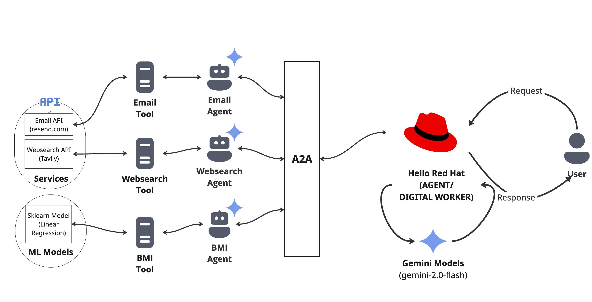

# Agent of remote Agents using Google's A2A
A sophisticated AI agent architecture that leverages the Google's A2A protocol 
to create modular, scalable intelligent assistants. This system allows AI agents to 
seamlessly interact with multiple applications and services through well-defined 
tool interfaces, demonstrating a powerful approach to building flexible and extensible 
AI solutions.

## Prerequisites
Set the following environment variables in your system.
1. `TAVILIA_API_KEY` - Sign up on `tavily.com` and get your tavily api key
2. `$RESEND_API_KEY` - Sign up on `resend.com` and get your resend api key
3. `$RESEND_EMAIL_ID` - Your resend email id that you used to sign up
4. `$GOOGLE_API_KEY` - Sign up on `console.cloud.google.com` and get your google api key
5. `$GEMINI_API_KEY` - Sign up on `aistudio.google.com` and get your gemini api key

## Technology Stack

1. AI Models: Google AI, Gemini 
2. Container Orchestration: Docker Compose 
3. ML Framework: scikit-learn 
4. Email Service: Resend 
5. Protocol: Google A2A

## Architecture
The system follows a modular architecture where:

- Agents access these tools through well-defined interfaces 
- An LLM orchestrates agent delegation based on user requests 
- Results are processed and formatted before being returned to the user

### Scalable Agent Development
One of the key strengths of this architecture is its scalability and modularity.

## Agent: Hello Red Hat

`Hello Red Hat`  has access to 3 GenAI Agents which are exposed via A2A (Agent 2 Agent)

### Agents
Following are the agents exposed via Google A2A protocol.
1. **WebSearch Agent**
    - Use this agent for any question related to *WebSearch* — The retrieved results from the web is formatted and cleaned by an LLM before returning the result.

2. **Email Agent**
    - Use this agent **only if the user explicitly requests to send an email**. An LLM is used to reformat the email body with proper HTML tags.

3. **BMI Agent**
    - Use this agent the user asks about calculating BMI (Body Mass Index). An Sklearn Linear Regression model is used behind the scene, which returns a score given the height and weight.

### Flow Diagram

### RUN
1. docker compose build
2. docker compose up -d
3. docker compose logs -f
4. go to http://localhost:8501
5. Demo - [link](https://youtu.be/IkmLi7BKrSc) 
6. docker compose down

