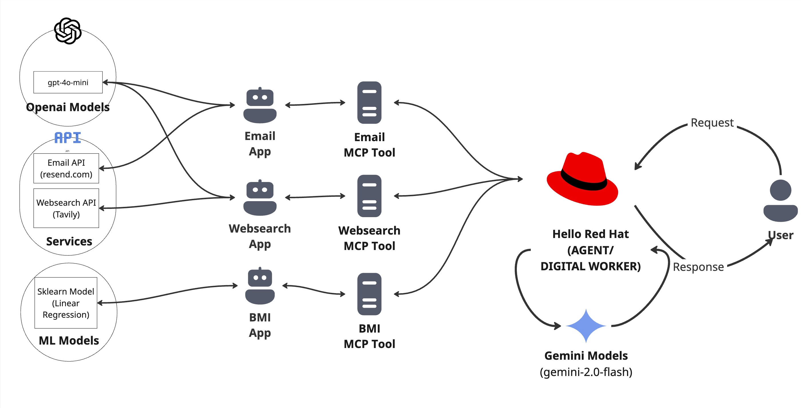

# Agent using Remote MCP Tools
A sophisticated AI agent architecture that leverages the Model Context Protocol (MCP) 
to create modular, scalable intelligent assistants. This system allows AI agents to 
seamlessly interact with multiple applications and services through well-defined 
tool interfaces, demonstrating a powerful approach to building flexible and extensible 
AI solutions.

## Prerequisites
Set the following environment variables in your system.
1. `$OPENAI_API_KEY` - Set up your openai account. Make sure you have enough credits - \$5
2. `$RESEND_API_KEY` - Sign up on `resend.com` and get your resend api key
3. `$RESEND_EMAIL_ID` - Your resend email id that you used to sign up
4. `$GOOGLE_API_KEY` - Sign up on `console.cloud.google.com` and get your google api key
5. `$GEMINI_API_KEY` - Sign up on `aistudio.google.com` and get your gemini api key

## Technology Stack

1. AI Models: OpenAI GPT, Google AI, Gemini 
2. Container Orchestration: Docker Compose 
3. ML Framework: scikit-learn 
4. Email Service: Resend 
5. Protocol: Model Context Protocol (MCP)

## Architecture
The system follows a modular architecture where:

- Applications are wrapped as MCP servers
- Agents access these applications through well-defined tool interfaces 
- An LLM orchestrates tool usage based on user requests 
- Results are processed and formatted before being returned to the user

### Scalable Agent Development
One of the key strengths of this architecture is its scalability and modularity.

### Scalability Benefits

- Modular Tool Addition: New capabilities can be added without modifying existing agent logic 
- Configuration-Based: Agent capabilities are defined through tool configurations, not code changes 
- Reusable Components: Common tools (like WebSearch and Email) are shared across agents 
- Easy Deployment: New agents use the same Docker infrastructure, just with different tool sets

## Agent: Hello Red Hat

`Hello Red Hat`  has access to 3 GenAI applications which are exposed as tools via MCP (Model Context Protocol)

### Tool
Following are the applications exposed via MCP as Tools.
1. **WebSearch App**
    - Use this for any question related to *WebSearch* — The retrieved results from the web is formatted and cleaned by an LLM before returning the result.

2. **Email App**
    - Use this tool **only if the user explicitly requests to send an email**. An LLM is used to reformat the email body with proper HTML tags.

3. **BMI App**
    - Use this tool the user asks about calculating BMI (Body Mass Index). An Sklearn Linear Regression model is used behind the scene, which returns a score given the height and weight.

### Flow Diagram

### RUN
1. docker compose build
2. docker compose up -d
3. docker compose logs -f
4. go to http://localhost:8501
5. Try to ask a question like
   - Q - "Send me the current BMI report via email of the lead actor/actress in the Netflix movie Kumari"
   - A - "**Thought:** The user asked me to send an email containing the BMI report of the lead actress in the Netflix movie Kumari. I first used the websearch tool to find out who the lead actress is. Then I used the websearch tool again to find the height and weight of the actress. After that, I used the BMI tool to calculate the BMI. Finally, I used the email tool to send the BMI report to Tuhin.

      **Action:** I have sent the email containing the BMI report of Aishwarya Lekshmi.

      **Observation:** The email has been sent successfully.

      **Final Answer:** I have sent an email to Tuhin with the subject "BMI report of Aishwarya Lekshmi" and the body "Dear Tuhin,\n\nThe BMI of Aishwarya Lekshmi is 21.94, which falls within the normal weight range.\n\nRegards,\nFedora"."
6. docker compose down

